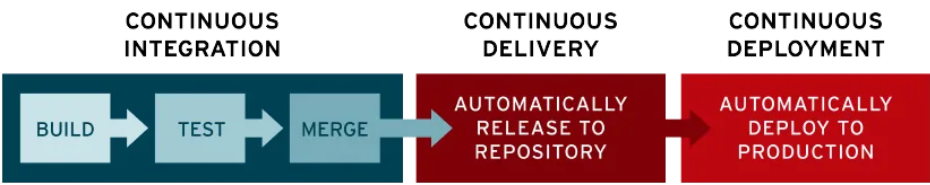

# CI/CD
O propósito da abordagem de CI/CD, sigla em inglês para integração e entrega/implantação contínuas, é otimizar e acelerar o ciclo de vida de desenvolvimento de software.

A integração contínua (CI) é a prática de integrar, de forma automática e frequente, mudanças a um repositório de código-fonte compartilhado.Já a implantação e/ou entrega contínua (CD) é um processo em duas etapas relacionado a integração, teste e entrega de mudanças no código. A entrega contínua é quase uma implantação automática em produção, enquanto a implantação contínua implica em automaticamente lançar atualizações no ambiente de produção.

Juntas, essas práticas relacionadas são muitas vezes chamadas de "pipeline de CI/CD".

## Por que CI/CD é importante?
Com uma abordagem de CI/CD, as empresas podem evitar bugs e falhas no código, além de manter um ciclo contínuo de desenvolvimento e atualizações do software. 

À medida que as apps evoluem, as funcionalidades de CI/CD ajudam a reduzir a complexidade, aumentar a eficiência e simplificar os fluxos de trabalho.

E como o pipeline de CI/CD automatiza o trabalho humano que em geral é necessário para que um novo código passe de um commit à produção, o downtime é minimizado e as versões atualizadas do código são disponibilizadas mais rápido. Além disso, com a capacidade de agilizar a integração de atualizações e mudanças no código, é possível incorporar o feedback dos usuários de maneira mais frequente e eficaz. Isso gera resultados positivos para os usuários e uma maior satisfação dos clientes em geral.

## O que é integração contínua?

Na sigla CI/CD, "CI" sempre se refere à integração contínua. Trata-se de um processo de automação que ajuda desenvolvedores a consolidar mudanças no código em uma ramificação (ou "tronco") compartilhada com mais frequência. À medida que as atualizações são feitas, etapas de teste automatizadas são acionadas para garantir a confiabilidade das mudanças consolidadas no código. 

No desenvolvimento moderno de aplicações, o objetivo é ter muitos desenvolvedores trabalhando ao mesmo tempo em diferentes funcionalidades da mesma app. No entanto, se uma organização tiver que consolidar todo o código-fonte ramificado em apenas um dia (conhecido como "merge day" ou "dia de consolidação"), o trabalho poderá ser monótono, manual e demorado. 

O motivo é que quando um desenvolvedor trabalha isoladamente fazendo mudanças na aplicação, há uma chance de que ocorram conflitos com outras alterações feitas ao mesmo tempo por outros desenvolvedores. Esse problema pode ser agravado se cada uma dessas pessoas tiver seu próprio ambiente de desenvolvimento integrado (IDE) personalizado. O ideal seria que a equipe entrasse em acordo com apenas um IDE baseado na nuvem.

A CI pode ser uma solução para o problema de ter muitas ramificações simultâneas e possivelmente conflitantes de uma app em desenvolvimento.

Uma implementação bem-sucedida de CI significa que, após um desenvolvedor consolidar mudanças no código de uma aplicação, essas atualizações são validadas com a automação da compilação e dos testes em diferentes níveis da aplicação. Normalmente, são executados testes automáticos de unidade e integração para garantir que as mudanças não danificaram a app. Para isso, são testados desde classes e função até os módulos que formam a app inteira. Caso os testes automatizados identifiquem um conflito entre o código novo e o anterior, com a CI é mais fácil corrigir tais bugs de forma mais rápida e frequente.

## O que é "CD" em CI/CD?

**CD** se refere à entrega contínua e/ou à implantação contínua, conceitos relacionados e usados alternadamente às vezes. Em ambos os casos, trata-se da automação de estágios subsequentes do pipeline, mas são usados separadamente de vez em quando para ilustrar o nível de automação. A escolha entre entrega contínua e implantação contínua depende da tolerância a riscos e das necessidades específicas das equipes de desenvolvimento e operações.

## O que é entrega contínua?

Entrega contínua se refere à automação da liberação do código validado para um repositório, seguida da automação da compilação e dos testes de unidade e integração executada na CI. Portanto, para que o processo de entrega contínua seja eficaz, é importante já ter a prática de CI incorporada ao pipeline de desenvolvimento.

Na entrega contínua, todos os estágios (da consolidação das mudanças no código à disponibilização de versões prontas para a produção) envolvem a automação de testes e da liberação do código. No final do processo, a equipe de operações pode implantar uma app em produção rapidamente.

Em geral, a entrega contínua serve para automaticamente verificar se há bugs nas mudanças feitas por desenvolvedores em uma aplicação e carregá-las em um repositório, como o GitHub ou um registro de containers. Nesse repositório, a equipe de operações pode implantar essas mudanças em um ambiente de produção ativo. É uma resposta para o problema da falta de visibilidade e comunicação entre equipes de desenvolvimento e linha de negócios. Nesse sentido, a finalidade da entrega contínua é ter uma base de código sempre pronta para a implantação em um ambiente de produção, com o mínimo de esforço para implantar código novo.

## O que é implantação contínua?
   
O estágio final de um pipeline de CI/CD bem desenvolvido é a implantação contínua. A implantação contínua é uma extensão da entrega contínua que se refere à liberação automática das mudanças feitas por desenvolvedores, do repositório à produção, onde podem ser usadas por clientes.

A CD resolve o problema da sobrecarga de trabalho das equipes de operações com processos manuais que atrasam a entrega de apps. Esse conceito aproveita os benefícios da entrega contínua ao automatizar a próxima etapa no pipeline.

Na prática, a implantação contínua significa que as mudanças feitas por desenvolvedores em uma aplicação na nuvem podem entrar em vigor em questão de minutos, caso passem em todos os testes automatizados. Isso faz com que seja muito mais fácil receber e incorporar continuamente o feedback dos usuários. Juntas, todas essas práticas associadas de CI/CD tornam a implantação de aplicações menos arriscada, além de facilitar a liberação gradual de mudanças. 

No entanto, como não há interferência manual no estágio final do pipeline antes da entrada em produção, a implantação contínua é altamente dependente de uma automação bem desenvolvida dos testes. Isso requer muito investimento inicial, já que tais testes precisam ser executados nos vários estágios do pipeline de CI/CD.

## Tecnologias para implantar o CI/CD em seu projeto

###  [GitHub Actions](./github-actions/README.md)

###  [Jenkins](./jenkins/README.md)