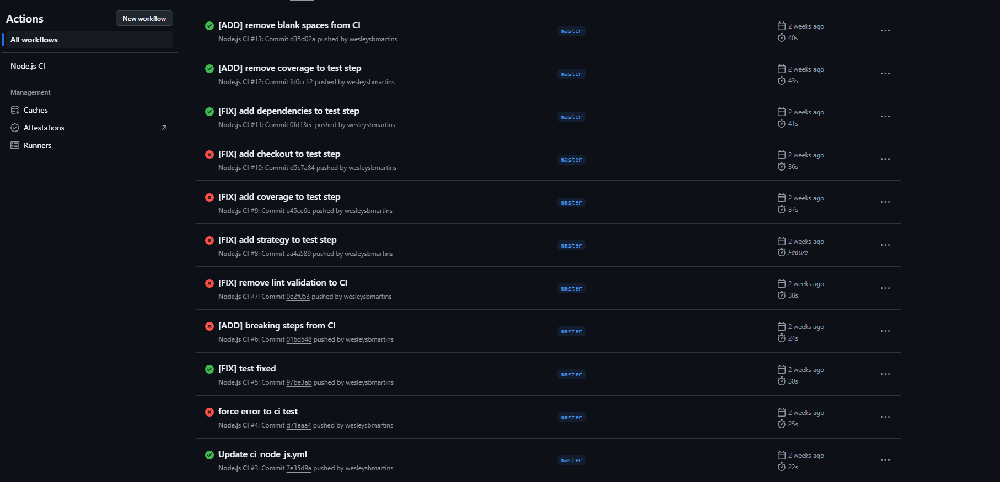

# GitHub Actions [](https://skillicons.dev)
GitHub Actions é uma plataforma de integração contínua e entrega contínua (CI/CD) que permite automatizar a sua compilação, testar e pipeline de implantação. É possível criar fluxos de trabalho que criam e testam cada pull request no seu repositório, ou implantar pull requests mesclados em produção.

GitHub Actions vai além de apenas DevOps e permite que você execute fluxos de trabalho quando outros eventos ocorrerem no seu repositório. Por exemplo, você pode executar um fluxo de trabalho para adicionar automaticamente as etiquetas apropriadas sempre que alguém cria um novo problema no repositório.

GitHub fornece máquinas virtuais do Linux, Windows e macOS para executar seus fluxos de trabalho, ou você pode hospedar seus próprios executores auto-hospedados na sua própria infraestrutura de dados ou na nuvem.

Para mais informações acesse a documentação do [GitHub Actions]("https://docs.github.com/pt/actions/about-github-actions/understanding-github-actions).

## Como criar uma Pipeline?
Para criar a pipeline da sua aplicação, acesse o github no repositório desejado, abra a aba **Actions** e explore os recursos disponíveis, ou se preferir, no seu ambiente de desenvolvimento você deve criar na raiz o projeto uma pasta **.github/workflows** e adicione um arquivo **yaml**.

Segue um exemplo de uma pipeline de CI para uma aplicação NodeJS que utiliza o Jest para testes unitários e de integração, que executa o build e os testes a cada atualização nas branchs principais:

```yaml

name: Node.js CI

on:
  push:
    branches: [ "master", "stage", "dev" ]
  pull_request:
    branches: [ "master", "stage", "dev" ]

jobs:
  build:
    runs-on: ubuntu-latest

    strategy:
      matrix:
        node-version: [20.x, 22.x, "node"]

    steps:
    - uses: actions/checkout@v4
    - name: Use Node.js ${{ matrix.node-version }}
      uses: actions/setup-node@v4
      with:
        node-version: ${{ matrix.node-version }}
        cache: 'npm'
    - run: npm ci
    - run: npm run build --if-present

  test:
    runs-on: ubuntu-latest
    needs: build
    steps:
      - uses: actions/checkout@v4
      - run: npm ci
      - run: npm test
```

Em caso de falhas você será notificado por email de que sua pipeline esta quebrando, o que signifca que sua aplicação contém erros.

E na sua aba de Actions do repositório poderá visualizar os problemas encontrados na sua aplicação.
