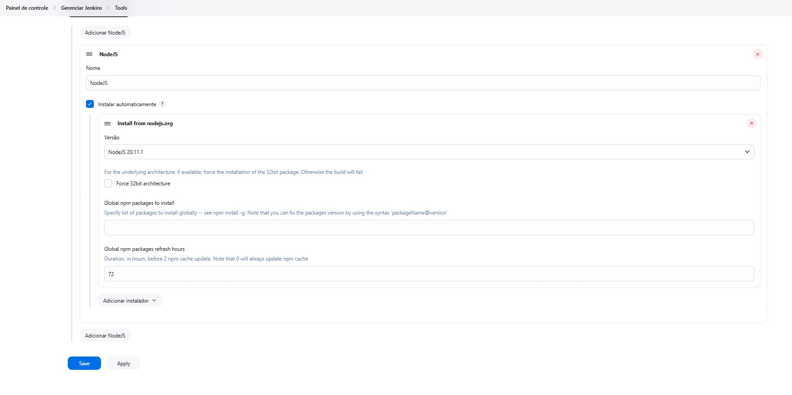
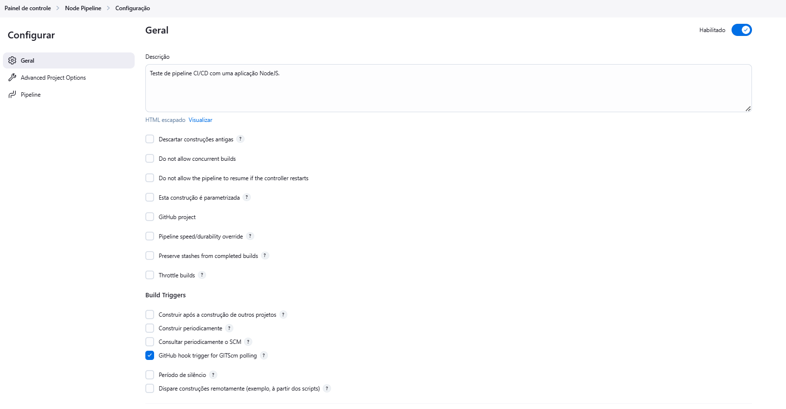
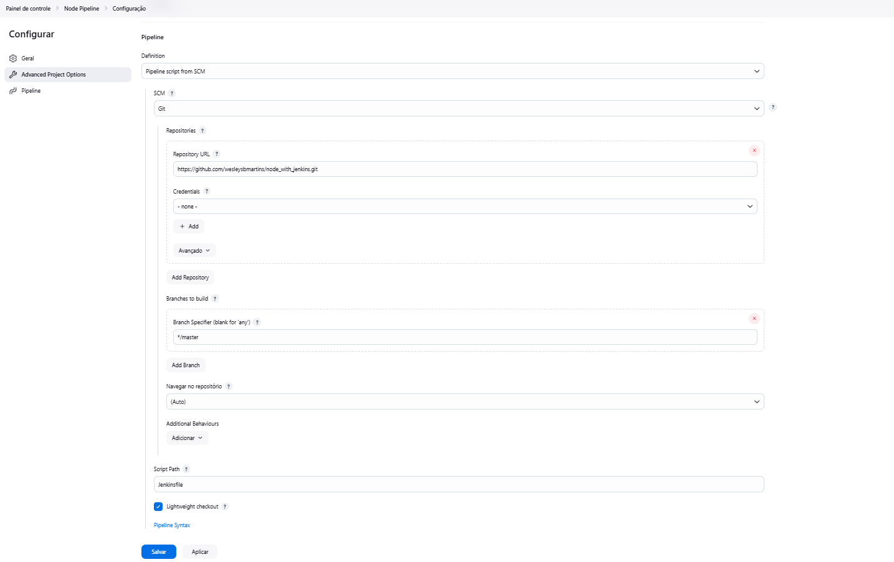
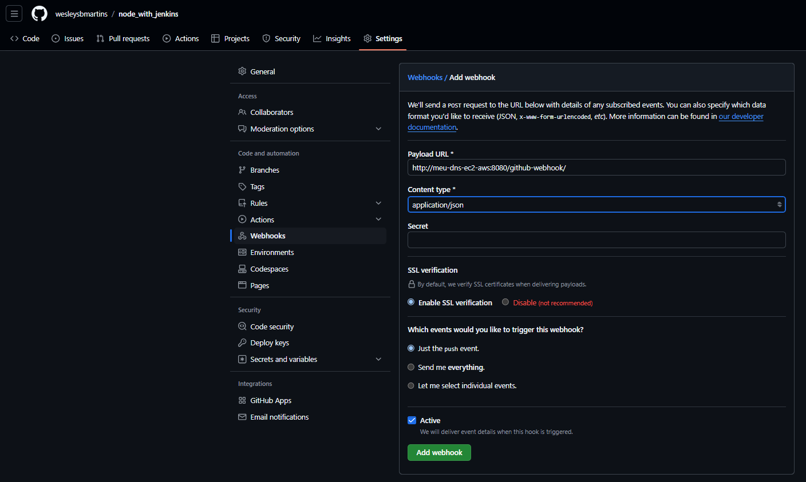
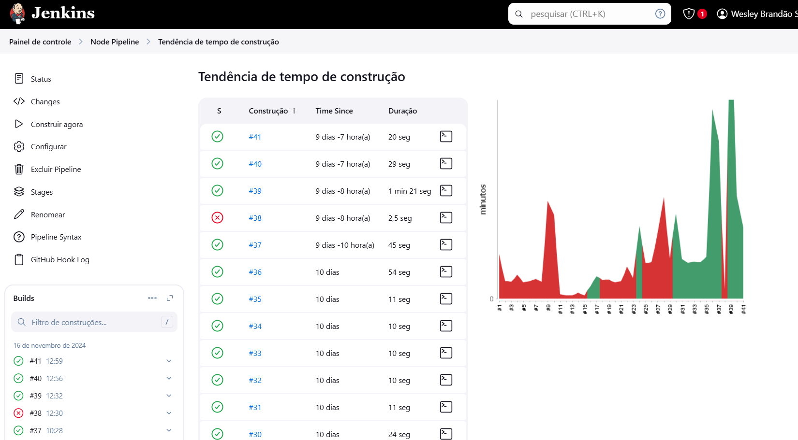

# Jenkins 
Jenkins é um servidor de automação de código aberto. Com o Jenkins, as organizações podem acelerar o processo de desenvolvimento de software automatizando-o.

O Jenkins gerencia e controla os processos de entrega de software em todo o ciclo de vida, incluindo construção, documento, teste, pacote, estágio, implantação, análise de código estático e muito mais.

Você pode configurar o Jenkins para observar qualquer mudança de código em lugares como GitHub, Bitbucket ou GitLab e fazer uma construção automática com ferramentas como Maven e Gradle. Você pode utilizar a tecnologia de contêiner, como Docker e Kubernetes, iniciar testes e, em seguida, realizar ações como retroceder ou avançar na produção.

Para utilizar o Jenkins você precisa ter o Java instalado em sua máquina, pois ele foi desenvolvido com esta linguagen portanto, depende de tecnologias do JDK do Java. Recomendo a utilização de versões LTS (Long Term Support) mais recentes.

## Como usar?

- [Instale o Java.](https://www.oracle.com/java/technologies/javase/jdk17-archive-downloads.html)

- [Instale o Jenkins.](https://www.jenkins.io/doc/book/installing/)

- Instale os plugins recomendados.

Com isso você já pode começar a trabalhar com o Jenkins!

## Como criar uma pipeline para uma aplicação NodeJS?

- Acesse seu Jenkins e instale o Plugin do NodeJS.
    > Gerenciar Jenkins > Plugins > Extensões disponíveis > Pesquise por NodeJs e realize a instalação.

- Configure o plugin do NodeJS, acesse:
    > Gerenciar Jenkins > Tools > NodeJS

    

- Crie a Pipeline, acesse:
    > Criar nova tarefa > Pipeline > Preencha as informações

Descrição e Build Triggers para o Git.

Para usar o seu repositório configure a pipeline como **Pipeline script from SCM, Git, a url do seu repositório, branch, e o caminho do seu arquivo Jenkinsfile do seu repositório no campo Script Path.**

Assim você tem sua pipeline configurada, para executa-la basta selecionar **Construir Agora** e desfrutar deste recurso.

Caso queira automaticar o disparo dessa construção, pode acessar seu repositório do GitHub na aba **Settings**, na barra lateral selecionar **Webhooks**, adicionar um webhook com a url apontando para seu servidor do Jenkins no path **/github-webhook/**, por exemplo:

Assim seu pipeline será executado de forma automatica:

> [Aplicação NodeJS usada como exemplo para criar Pipeline de CI/CD com Jenkins.](https://github.com/wesleysbmartins/node_with_jenkins)